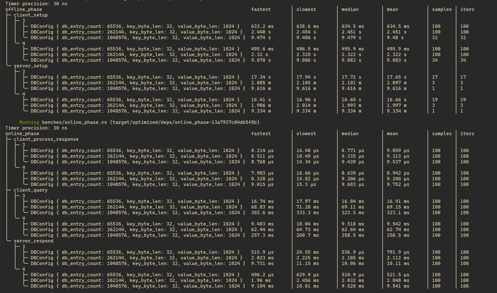
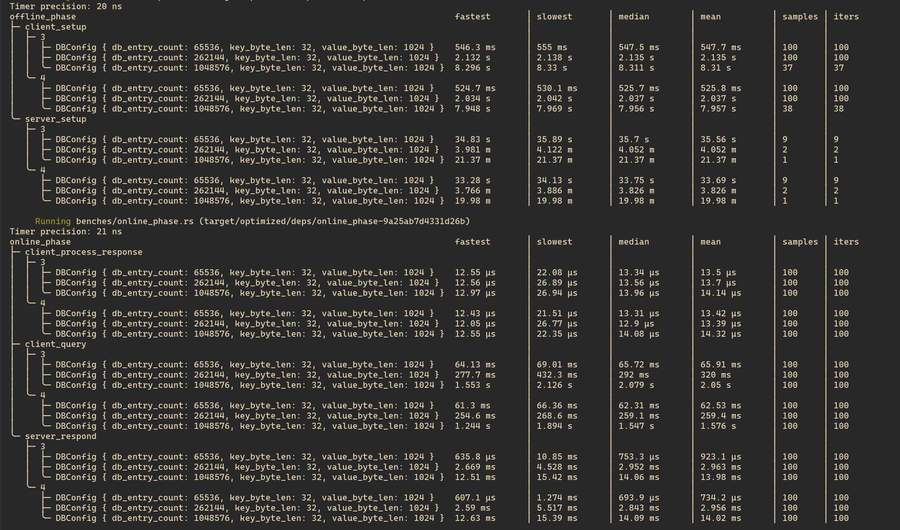
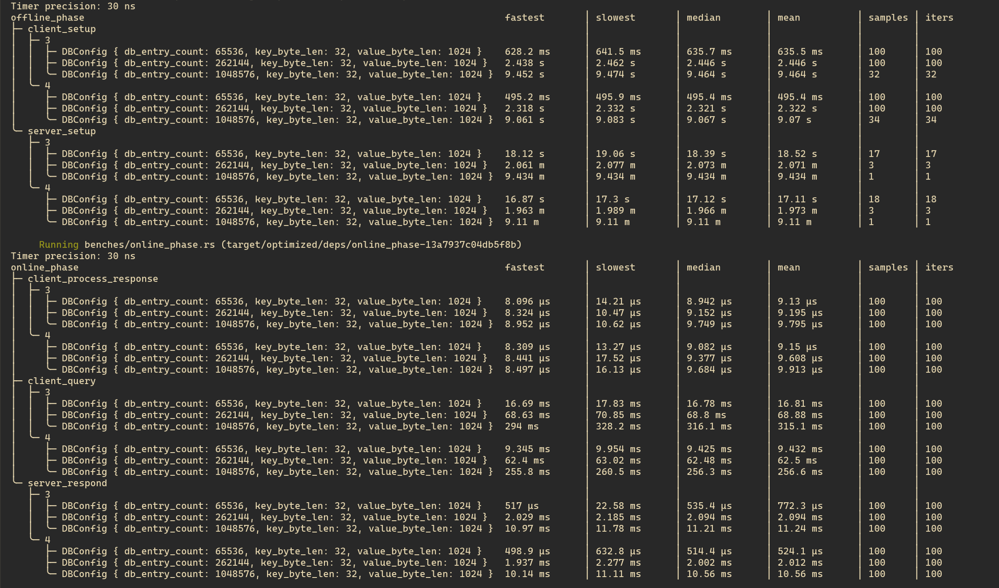

# ChalametPIR
Simple, Practical, Single-Server Private Information Retrieval for Keyword Queries

## Overview
ChalametPIR is a very simple, stateful, single-server *P*rivate *I*nformation *R*etrieval (PIR) scheme for keyword queries,
built on top of FrodoPIR - a practical, single-server, stateful LWE -based PIR scheme and Binary Fuse Filter - an efficient probabilistic data structure.

- FrodoPIR was proposed in https://ia.cr/2022/981.
- Binary Fuse Filter was proposed in https://arxiv.org/pdf/2201.01174.
- And ChalametPIR was proposed in https://ia.cr/2024/092.

ChalametPIR allows a client to retrieve a specific value from a key-value database, stored on a server, without revealing the requested key to the server. It uses Binary Fuse Filters to encode key-value pairs in form of a matrix. And then it applies FrodoPIR on the encoded database matrix to actually retrieve values for requested keys.

The protocol has two participants:

**Server:**
Implemented by [chalametpir_server](./chalametpir_server) crate.

* **`setup`:** Initializes the server with a seed, a key-value database, generating a public matrix, a hint matrix, and a Binary Fuse Filter (3-wise XOR or 4-wise XOR, configurable at compile time). It returns serialized representations of the hint matrix and filter parameters. This phase can be completed offline and is completely client-agnostic. But it is very compute-intensive, which is why this library allows you to offload expensive matrix multiplication and transposition to a GPU, gated behind the opt-in `gpu` feature. For large key-value databases (e.g., with >= $2^{18}$ entries), I recommend enabling the `gpu` feature, as it can significantly reduce the cost of the server-setup phase.
* **`respond`:** Processes a client's encrypted query, returning an encrypted response vector.

**Client:**
Implemented by [chalametpir_client](./chalametpir_client) crate.

* **`setup`:** Initializes the client using the seed, serialized hint matrix and filter parameters received from the server.
* **`query`:** Generates an encrypted PIR query for a given key, which can be sent to server.
* **`process_response`:** Decrypts the server's response and extracts the requested value.

To paint a more practical picture, imagine, we have a database with $2^{20}$ (~1 million) keys s.t. each key is 32 -bytes and each value is 1024 -bytes (1kB).

**ChalametPIR Protocol Steps**

1) Server gets a 32 -bytes seed and the key-value database as input, returns a **6670248 -bytes (~6.36mB)** hint and **68 -bytes** Binary Fuse Filter parameters.
2) Client receives the seed, hint and Binary Fuse Filter parameters, sets itself up.
3) Client wants to privately look up a key in the server held key-value database, it generates an encrypted query of **4718600 -bytes (~4.5mB)**, when 3-wise XOR Binary Fuse Filter is used. If server decided to use a 4-wise XOR Binary Fuse Filter, query size would be **4521992 -bytes (~4.31mB)**. Client sends this encrypted query to server.
4) Server computes encrypted response of **3768 -bytes (~3.68kB)**, touching every single bit of the database.
5) Client receives the encrypted response and decrypts it.

We are setting up both server and client(s), on each of

Machine Type | Machine | Kernel | Compiler | Memory Read Speed
--- | --- | --- | --- | ---
(a) aarch64 server | AWS EC2 `m8g.8xlarge` | `Linux 6.8.0-1028-aws aarch64` | `rustc 1.86.0 (05f9846f8 2025-03-31)` | 28.25 GB/s
(b) x86_64 server | AWS EC2 `m7i.8xlarge` | `Linux 6.8.0-1028-aws x86_64` | `rustc 1.86.0 (05f9846f8 2025-03-31)` | 10.33 GB/s
(c) aarch64 server | AWS EC2 `r8g.8xlarge` | `Linux 6.8.0-1028-aws aarch64` | `rustc 1.86.0 (05f9846f8 2025-03-31)` | 28.25 GB/s

and this implementation of ChalametPIR is compiled with specified compiler, in `optimized` profile. See [Cargo.toml](./Cargo.toml).

> [!NOTE]
> Memory read speed is measured using `$ sysbench memory --memory-block-size=1G --memory-total-size=20G --memory-oper=read run` command.

Step | `(a)` Time Taken on `aarch64` server | `(b)` Time Taken on `x86_64` server | Ratio `a / b`
:-- | --: | --: | --:
`server_setup` | 9.62 minutes | 21.37 minutes | 0.45
`client_setup` | 9.48 seconds | 8.31 seconds | 1.14
`client_query` | 323.5 milliseconds | 2.08 seconds | 0.16
`server_respond` | 10.06 milliseconds | 14.06 milliseconds | 0.72
`client_process_response` | 9.44 microseconds | 13.96 microseconds | 0.68

So, the median bandwidth of the `server_respond` algorithm, which needs to traverse through the whole processed database, is
- (a) For `aarch64` server: 102.51 GB/s
- (b) For `x86_64` server: 73.35 GB/s

For demonstrating the effectiveness of offloading parts of the server-setup phase to a GPU, I benchmark it on AWS EC2 instance `g6e.8xlarge`, which features a NVIDIA L40S Tensor Core GPU and $3^{rd}$ generation AMD EPYC CPUs.

Number of entries in DB | Key length | Value length | `(a)` Time taken to setup PIR server on CPU | `(b)` Time taken to setup PIR server, partially offloading to GPU | Ratio `a / b`
:-- | --: | --: | --: | --: | --:
$2^{16}$ | 32B | 1kB | 19.55 seconds | 19.39 seconds | 1.0
$2^{18}$ | 32B | 1kB | 6.0 minutes | 2.23 minutes | 2.69
$2^{20}$ | 32B | 1kB | 25.89 minutes | 25.58 seconds | 60.72

For small key-value databases, it is not worth offloading server-setup to the GPU, but for databases with entries >= $2^{18}$, it is recommended to enable `gpu` feature, when GPU is available.

> [!NOTE]
> In both of above tables, I show only the median timing measurements, while the DB is encoded using a 3 -wise XOR Binary Fuse Filter. For more results, with more database configurations, see benchmarking [section](#benchmarking) below.

## Prerequisites
Rust stable toolchain; see https://rustup.rs for installation guide. MSRV for this crate is 1.85.0.

```bash
# While developing this library, I was using
$ rustc --version
rustc 1.85.1 (e71f9a9a9 2025-01-27)
```

If you plan to offload server-setup to GPU, you need to install Vulkan drivers and library for your target setup. I followed https://linux.how2shout.com/how-to-install-vulkan-on-ubuntu-24-04-or-22-04-lts-linux on Ubuntu 24.04 LTS, with Nvidia GPUs - it was easy to setup.

## Testing
The ChalametPIR library includes comprehensive tests to ensure functional correctness.

- **Property -based Tests:** Verify individual components: matrix operations (multiplication, addition), Binary Fuse Filter construction (3-wise and 4-wise XOR, including bits-per-entry (BPE) validation), and serialization/deserialization of `Matrix` and `BinaryFuseFilter`.
- **Integration Tests:** Cover end-to-end PIR protocol functionality: key-value database encoding/decoding (parameterized by database size, key/value lengths, and filter arity), and client-server interaction to verify correct value retrieval without key disclosure (tested with both 3-wise and 4-wise XOR filters).

To run the tests, go to the project's root directory and issue:

```bash
# Custom profile to make tests run faster!
# Default debug mode is too slow!
cargo test --profile test-release

# For testing if offloading to GPU works as expected.
cargo test --features gpu --profile test-release
```


## Benchmarking
Performance benchmarks are included to evaluate the efficiency of the PIR scheme. These benchmarks measure the time taken for various PIR operations.

To run the benchmarks, execute the following command from the root of the project:

```bash
# Run all benchmarks.
cargo bench --profile optimized

# For benchmarking only the server-setup phase, offloaded to the GPU.
cargo bench --features gpu --profile optimized --bench offline_phase -q server_setup
```

> [!WARNING]
> When benchmarking make sure you've disabled CPU frequency scaling, otherwise numbers you see can be misleading. I find https://github.com/google/benchmark/blob/b40db869/docs/reducing_variance.md helpful.

### On AWS EC2 Instance `m8g.8xlarge` (aarch64)


### On AWS EC2 Instance `m7i.8xlarge` (x86_64)


### On AWS EC2 Instance `r8g.8xlarge` (aarch64)


> [!NOTE]
> More about AWS EC2 instances @ https://aws.amazon.com/ec2/instance-types.

## Usage

- For understanding how PIR server library crate `chalametpir_server` can be used, read [this](./chalametpir_server/README.md).
- While for using PIR client library crate `chalametpir_client`, read [this](./chalametpir_client/README.md).

The constant parameter `ARITY` (3 or 4) in `Server::setup` controls the type of Binary Fuse Filter used to encode the KV database, which affects size of the query vector and the encoded database dimensions, stored in-memory server-side. This implementation should allow you to run PIR queries on a KV database with at max 2^42 (~4 trillion) number of entries.

I maintain two example binaries, implementing PIR server and client execution flow.

```bash
# First, issue following command on one terminal window.
$ cargo run --example server --profile optimized

PIR Server listening @ 127.0.0.1:8080
New connection from PIR client @ 127.0.0.1:43322
Sent setup data to PIR client @ 127.0.0.1:43322
Received query of length 200B, from PIR client @ 127.0.0.1:43322
Sent response of length 104B, to PIR client @ 127.0.0.1:43322
...
```

```bash
# And then run this command on another terminal window.
$ cargo run --example client --profile optimized

Connected to PIR server @ 127.0.0.1:8080
Received setup data from PIR server
Generated query for key: [98, 97, 110, 97, 110, 97]
Sent query of length 200B
Received response of length 104B
Retrieved value: 'yellow'
```
