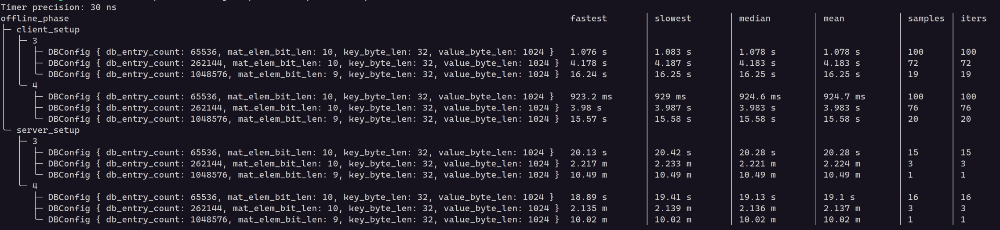
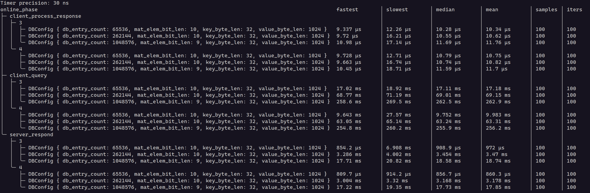
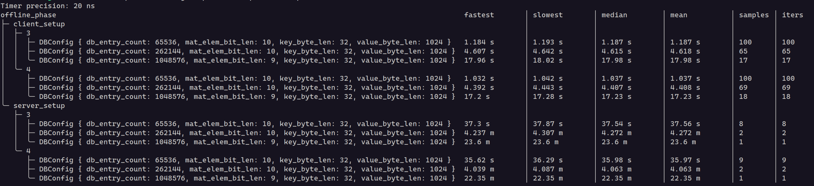
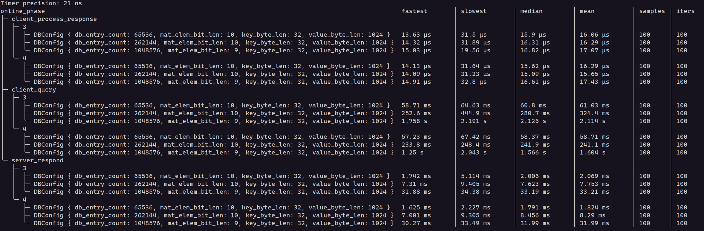

# ChalametPIR
Simple, Practical, Single-Server Private Information Retrieval for Keyword Queries

## Overview
ChalametPIR is a very simple, stateful, single-server *P*rivate *I*nformation *R*etrieval (PIR) scheme for keyword queries,
built on top of FrodoPIR - a practical, single-server, stateful LWE -based PIR scheme and Binary Fuse Filter - an efficient probabilistic data structure.

- FrodoPIR was proposed in https://ia.cr/2022/981.
- Binary Fuse Filter was proposed in https://arxiv.org/pdf/2201.01174.
- And ChalametPIR was proposed in https://ia.cr/2024/092.

ChalametPIR allows a client to retrieve a specific value from a key-value database on a server without revealing the requested key.
It uses Binary Fuse Filters to encode key-value pairs in form of a matrix. And then it applies FrodoPIR on the encoded database matrix
to actually retrieve values for requested keys.

The protocol has two participants:

**Server:**
* **`setup`:** Initializes the server with a key-value database, generating a public matrix, a hint matrix, and a Binary Fuse Filter (3-wise XOR or 4-wise XOR, compile-time configurable). Returns serialized representations of the hint matrix and filter parameters. This phase can be completed in offline and it's completely client agnostic.
* **`respond`:** Processes a client's query and returns an encrypted response vector.

**Client:**
* **`setup`:** Initializes the client using the serialized hint matrix and filter parameters received from the server.
* **`query`:** Generates a PIR query for a given key, which can be sent to server.
* **`process_response`:** Decrypts the server's response and extracts the requested value.

To paint a more practical picture, imagine, we have a database with $2^{20}$ (~1 million) keys s.t. each key is 32 -bytes and each value is 1024 -bytes (1kB). We are setting up both server and client(s), on each of

Machine Type | Machine | Kernel | Compiler | Memory Read Speed
--- | --- | --- | --- | ---
aarch64 server | AWS EC2 `m8g.8xlarge` | `Linux 6.8.0-1021-aws aarch64` | `rustc 1.84.1 (e71f9a9a9 2025-01-27)` | 28.25 GB/s
x86_64 server | AWS EC2 `m7i.8xlarge` | `Linux 6.8.0-1021-aws x86_64` | `rustc 1.84.1 (e71f9a9a9 2025-01-27)` | 10.33 GB/s

and this implementation of ChalametPIR is compiled with specified compiler, in `optimized` profile. See [Cargo.toml](./Cargo.toml).

> [!NOTE]
> Memory read speed is measured using `$ sysbench memory --memory-block-size=1G --memory-total-size=20G --memory-oper=read run` command.

Step | `(a)` Time Taken on `aarch64` server | `(b)` Time Taken on `x86_64` server | Ratio `a / b`
:-- | --: | --: | --:
`server_setup` | 10.49 minutes | 23.6 minutes | 0.44
`client_setup` | 16.25 seconds | 17.98 seconds | 0.9
`client_query` | 262.5 milliseconds | 2.13 seconds | 0.12
`server_respond` | 18.58 milliseconds | 33.19 milliseconds | 0.56
`client_process_response` | 11.69 microseconds | 16.82 microseconds | 0.7

> [!NOTE]
> In above table, I show only the median timing measurements, while the DB is encoded using a 3 -wise XOR Binary Fuse Filter. For more results, with more database configurations, see benchmarking [section](#benchmarking) below.

So, the median bandwidth of the `server_respond` algorithm, which needs to traverse through the whole processed database, is
- (a) For `aarch64` server: 53.82 GB/s
- (b) For `x86_64` server: 30.12 GB/s

## Prerequisites
Rust stable toolchain; see https://rustup.rs for installation guide. MSRV for this crate is 1.84.0.

```bash
# While developing this library, I was using
$ rustc --version
rustc 1.84.1 (e71f9a9a9 2025-01-27)
```

## Testing
The `chalamet_pir` library includes comprehensive tests to ensure functional correctness.

- **Property -based Tests:** Verify individual components: matrix operations (multiplication, addition), Binary Fuse Filter construction (3-wise and 4-wise XOR, including bits-per-entry (BPE) validation), and serialization/deserialization of `Matrix` and `BinaryFuseFilter`.
- **Integration Tests:** Cover end-to-end PIR protocol functionality: key-value database encoding/decoding (parameterized by database size, key/value lengths, and filter arity), and client-server interaction to verify correct value retrieval without key disclosure (tested with both 3-wise and 4-wise XOR filters).

To run the tests, go to the project's root directory and issue:

```bash
cargo test --profile test-release # Custom profile to make tests run faster!
                                  # Default debug mode is too slow!
```


## Benchmarking
Performance benchmarks are included to evaluate the efficiency of the PIR scheme. These benchmarks measure the time taken for various PIR operations.

To run the benchmarks, execute the following command from the root of the project:

```bash
cargo bench --all-features --profile optimized # For benchmarking the online phase of the PIR,
                                               # you need to enable feature `mutate_internal_client_state`,
                                               # passing `--all-features` does that.
```

> [!WARNING]
> When benchmarking make sure you've disabled CPU frequency scaling, otherwise numbers you see can be misleading. I find https://github.com/google/benchmark/blob/b40db869/docs/reducing_variance.md helpful.

### On AWS EC2 Instance `m8g.8xlarge` (aarch64)

---



### On AWS EC2 Instance `m7i.8xlarge` (x86_64)

---


> [!NOTE]
> More about AWS EC2 instances @ https://aws.amazon.com/ec2/instance-types.

## Usage
First, add this library crate as a dependency in your Cargo.toml file.

```toml
[dependencies]
chalamet_pir = "=0.2.0"
```

Then, let's code a very simple keyword PIR scheme:

```rust
use chalamet_pir::{client::Client, server::Server};
use rand::prelude::*;
use rand_chacha::ChaCha8Rng;
use std::collections::HashMap;

fn main() {
    // Example database (replace with your own)
    let mut db: HashMap<&[u8], &[u8]> = HashMap::new();
    db.insert(b"apple", b"red");
    db.insert(b"banana", b"yellow");

    // Server setup (offline phase)
    let mut rng = ChaCha8Rng::from_os_rng();
    let mut seed_μ = [0u8; 32]; // You'll want to generate a cryptographically secure random seed
    rng.fill_bytes(&mut seed_μ);

    let (server, hint_bytes, filter_param_bytes) = Server::setup::<3>(&seed_μ, db.clone()).expect("Server setup failed");

    // Client setup (offline phase)
    let mut client = Client::setup(&seed_μ, &hint_bytes, &filter_param_bytes).expect("Client setup failed");

    // Client query (online phase)
    let key = b"banana";
    if let Ok(query) = client.query(key) {
        // Send `query` to the server

        // Server response (online phase)
        let response = server.respond(&query).expect("Server failed to respond");

        // Client processes the response (online phase)
        if let Ok(value) = client.process_response(key, &response) {
            println!("Retrieved value: '{}'", String::from_utf8_lossy(&value)); // Should print "yellow"
        } else {
            println!("Failed to retrieve value.");
        }
    } else {
        println!("Failed to generate query.");
    }
}
```

The constant parameter `ARITY` (3 or 4) in `Server::setup` controls the type of Binary Fuse Filter used to encode the KV database, which affects size of the query vector and the encoded database dimensions, stored in-memory server-side. This implementation should allow you to run PIR queries on a KV database with at max 2^42 (~4 trillion) number of entries.

I maintain one example [program](./examples/kw_pir.rs) which demonstrates usage of the ChalametPIR API.

```bash
cargo run --example kw_pir --profile optimized
```

```bash
# Using 3-wise XOR Binary Fuse Filter
ChalametPIR:
Number of entries in Key-Value Database   : 65536
Size of each key                          : 8.0B
Size of each value                        : 4.0B
Arity of Binary Fuse Filter               : 3
Seed size                                 : 32.0B
Hint size                                 : 207.9KB
Filter parameters size                    : 68.0B
Query size                                : 304.0KB
Response size                             : 144.0B

⚠️ Random key '115560' is not present in DB
✅ '29520' maps to 'L', in 417.284µs
⚠️ Random key '97022' is not present in DB
⚠️ Random key '79601' is not present in DB
✅ '57270' maps to 'מ', in 570.426µs
⚠️ Random key '95069' is not present in DB
⚠️ Random key '102703' is not present in DB
⚠️ Random key '113549' is not present in DB
✅ '2293' maps to 'T', in 647.202µs
⚠️ Random key '92678' is not present in DB
⚠️ Random key '90071' is not present in DB
✅ '61493' maps to 'f', in 552.899µs
✅ '41360' maps to 'c', in 533.403µs
⚠️ Random key '67047' is not present in DB
✅ '55793' maps to 'z', in 531.056µs
⚠️ Random key '72809' is not present in DB
✅ '32741' maps to 'P', in 672.91µs
✅ '29361' maps to 'T', in 530.348µs
✅ '33143' maps to 'W', in 355.938µs
⚠️ Random key '87591' is not present in DB

# --- --- --- --- --- --- --- --- --- --- --- --- --- --- --- --- --- ---

# Using 4-wise XOR Binary Fuse Filter
ChalametPIR:
Number of entries in Key-Value Database   : 65536
Size of each key                          : 8.0B
Size of each value                        : 4.0B
Arity of Binary Fuse Filter               : 4
Seed size                                 : 32.0B
Hint size                                 : 207.9KB
Filter parameters size                    : 68.0B
Query size                                : 292.0KB
Response size                             : 144.0B

✅ '9445' maps to 'x', in 416.617µs
⚠️ Random key '120774' is not present in DB
⚠️ Random key '81310' is not present in DB
✅ '29502' maps to 'S', in 292.054µs
✅ '58360' maps to 'c', in 237.823µs
⚠️ Random key '74424' is not present in DB
⚠️ Random key '96217' is not present in DB
✅ '60430' maps to 'X', in 380.674µs
✅ '47703' maps to 'X', in 252.425µs
✅ '13076' maps to 'V', in 312.977µs
✅ '53385' maps to 'o', in 255.729µs
⚠️ Random key '90470' is not present in DB
✅ '46869' maps to 'h', in 275.5µs
⚠️ Random key '127543' is not present in DB
⚠️ Random key '105528' is not present in DB
⚠️ Random key '76357' is not present in DB
✅ '56523' maps to 'a', in 254.195µs
✅ '11499' maps to 'K', in 286.938µs
✅ '44878' maps to 'J', in 258.759µs
⚠️ Random key '74422' is not present in DB
```
